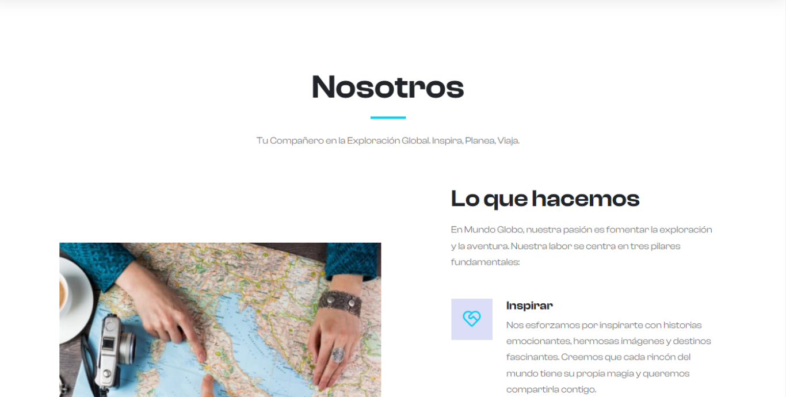
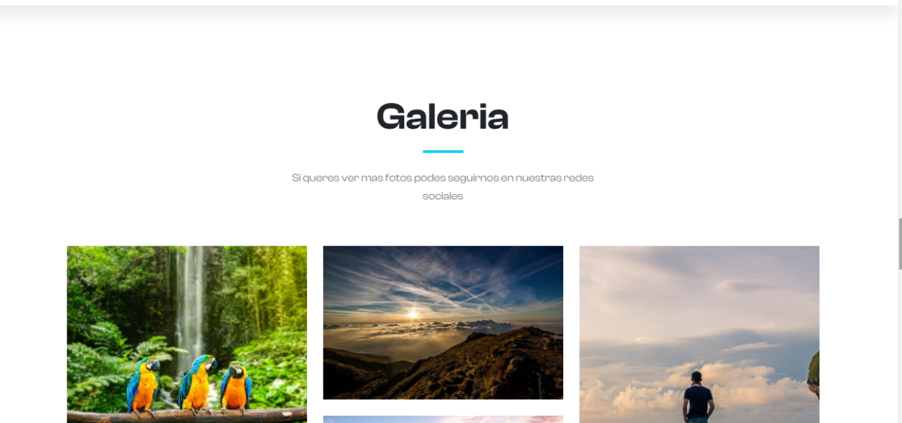

# Mundo Globo

## Descripción
Mundo Globo es un sitio web que te transporta a una exploración visual del mundo a través de relatos de viaje, imágenes cautivadoras y consejos prácticos. 
Este proyecto está diseñado para demostrar mis habilidades en el desarrollo front-end y la creación de experiencias visuales atractivas.

## Diseño y Estilo
El diseño de Mundo Globo se centra en la simplicidad y la elegancia. La paleta de colores suaves y la tipografía legible hacen que la experiencia del usuario sea agradable. 
El uso de animaciones sencillas, como el desplazamiento suave y las transiciones fluidas, agrega un toque de sofisticación al sitio.

## Funcionalidades Destacadas
- Asesoramiento de Viaje Personalizado
- Guías de Viaje Detalladas
- Experiencias de Viaje en Grupo
- Recursos de Viaje en Línea

## Vista Previa

## Requisitos
- Navegador web moderno
- Conexión a Internet

## Tecnologías Utilizadas
- HTML5
- CSS3
- Bootstrap
- JavaScript
- jQuery
- Fancybox
- AOS (Animate On Scroll)

## Cómo Probar
1. Clona este repositorio en tu máquina local.
2. Abre el archivo `index.html` en tu navegador web para explorar el sitio.

## Contribución
Si deseas colaborar en este proyecto o tienes sugerencias para mejorarlo, ¡no dudes en contactarme!

## Licencia
Este proyecto está bajo la [Licencia MIT](LICENSE).

---

© Dev.Eugenius - [Mi Perfil en GitHub](https://github.com/deveugenius)

