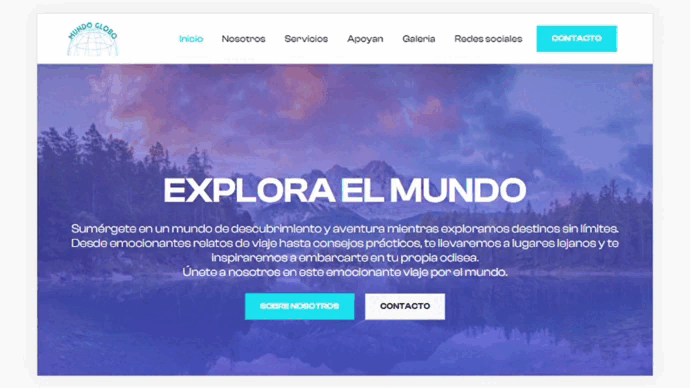

# Globe World

## Description
Mundo Globo is a website that takes you on a visual exploration of the world through travel stories, captivating images and practical advice.
This project is designed to demonstrate my skills in front-end development and creating engaging visual experiences.

## Design and style
Mundo Globo's design focuses on simplicity and elegance. The soft color palette and readable typography make for a pleasant user experience.
Using simple animations such as smooth scrolling and fluid transitions adds a touch of sophistication to the site.

## Featured Features
- Personalized Travel Advice
- Detailed Travel Guides
- Group Travel Experiences
- Online Travel Resources

## Preview

## Requirements
- Modern web browser
- Internet connection

## Used technology
- HTML5
-CSS3
- Bootstrap
- JavaScript
-jQuery
-Fancybox
- AOS (Animate On Scroll)

## How to Test
1. Clone this repository to your local machine.
2. Open the `index.html` file in your web browser to explore the site.

## Contribution
If you want to collaborate on this project or have suggestions to improve it, don't hesitate to contact me!

## License
This project is under the [MIT License](LICENSE.md).

